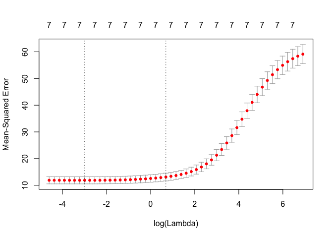

Intro
=====

This notebook is an online appendix of my blog post on Collinearity and
Feature Selection, where I play with the concepts using R code.

The dataset
===========

We will use the [auto-mpg
dataset](https://archive.ics.uci.edu/ml/datasets/auto+mpg), where we
will try to predict the miles per galon (mpg) consumption given some car
related features like horsepower, weight etc.

    fileURL <- "https://archive.ics.uci.edu/ml/machine-learning-databases/auto-mpg/auto-mpg.data"
    download.file(fileURL, destfile="auto-mpg.data", method="curl")
    data <- read.table("auto-mpg.data", na.strings = "?", quote='"', dec=".", header=F)
    # remove instances with missing values and the name of the car
    data <- data[complete.cases(data),-9]
    summary(data)

    ##        V1              V2              V3              V4       
    ##  Min.   : 9.00   Min.   :3.000   Min.   : 68.0   Min.   : 46.0  
    ##  1st Qu.:17.00   1st Qu.:4.000   1st Qu.:105.0   1st Qu.: 75.0  
    ##  Median :22.75   Median :4.000   Median :151.0   Median : 93.5  
    ##  Mean   :23.45   Mean   :5.472   Mean   :194.4   Mean   :104.5  
    ##  3rd Qu.:29.00   3rd Qu.:8.000   3rd Qu.:275.8   3rd Qu.:126.0  
    ##  Max.   :46.60   Max.   :8.000   Max.   :455.0   Max.   :230.0  
    ##        V5             V6              V7              V8       
    ##  Min.   :1613   Min.   : 8.00   Min.   :70.00   Min.   :1.000  
    ##  1st Qu.:2225   1st Qu.:13.78   1st Qu.:73.00   1st Qu.:1.000  
    ##  Median :2804   Median :15.50   Median :76.00   Median :1.000  
    ##  Mean   :2978   Mean   :15.54   Mean   :75.98   Mean   :1.577  
    ##  3rd Qu.:3615   3rd Qu.:17.02   3rd Qu.:79.00   3rd Qu.:2.000  
    ##  Max.   :5140   Max.   :24.80   Max.   :82.00   Max.   :3.000

Preprocessing
=============

Let's also normalize the dataset (values to be in the interval \[0,1\]),
an operation that will maintain the correllation between the variables,
and split between training and testing.

    normalize <- function(x) {
      (x - min(x, na.rm=TRUE))/(max(x,na.rm=TRUE) - min(x, na.rm=TRUE))
    }
    normData <- cbind(data[,1], as.data.frame(lapply(data[,-1], normalize)))

    # name variables
    names(normData) <- c("mpg", "cylinders", "displacement", "horsepower", "weight", "acceleration", "model_year", "origin")

    # check correlation
    cat("Before:", cor(data$V3, data$V5), "\n")

    ## Before: 0.9329944

    cat("After norm.:", cor(normData$displacement, normData$weight))

    ## After norm.: 0.9329944

    # Train/Test split
    library(tidyverse)

    ## ── Attaching packages ────────────────────────────────────────────────────────── tidyverse 1.2.1 ──

    ## ✔ ggplot2 2.2.1     ✔ purrr   0.2.4
    ## ✔ tibble  1.4.2     ✔ dplyr   0.7.4
    ## ✔ tidyr   0.8.0     ✔ stringr 1.3.0
    ## ✔ readr   1.1.1     ✔ forcats 0.3.0

    ## ── Conflicts ───────────────────────────────────────────────────────────── tidyverse_conflicts() ──
    ## ✖ dplyr::filter() masks stats::filter()
    ## ✖ dplyr::lag()    masks stats::lag()

    library(caret)

    ## Loading required package: lattice

    ## 
    ## Attaching package: 'caret'

    ## The following object is masked from 'package:purrr':
    ## 
    ##     lift

    training.samples <- normData$mpg %>%
    createDataPartition(p = 0.8, list = FALSE)
    train.data  <- normData[training.samples, ]
    test.data <- normData[-training.samples, ]

Modelling
=========

Linear Regression
-----------------

Aka Ordinary Linear Regression:

    linearModel <- lm(mpg ~., data = train.data)
    summary(linearModel)

    ## 
    ## Call:
    ## lm(formula = mpg ~ ., data = train.data)
    ## 
    ## Residuals:
    ##    Min     1Q Median     3Q    Max 
    ## -9.522 -2.180 -0.066  1.957 13.150 
    ## 
    ## Coefficients:
    ##              Estimate Std. Error t value Pr(>|t|)    
    ## (Intercept)   26.2508     1.3271  19.781  < 2e-16 ***
    ## cylinders     -2.4423     1.8955  -1.289   0.1985    
    ## displacement   7.7660     3.2604   2.382   0.0178 *  
    ## horsepower    -4.0911     2.7877  -1.468   0.1432    
    ## weight       -22.3801     2.6146  -8.560 5.51e-16 ***
    ## acceleration   0.9243     1.8661   0.495   0.6207    
    ## model_year     8.9281     0.6852  13.031  < 2e-16 ***
    ## origin         2.9176     0.6372   4.578 6.81e-06 ***
    ## ---
    ## Signif. codes:  0 '***' 0.001 '**' 0.01 '*' 0.05 '.' 0.1 ' ' 1
    ## 
    ## Residual standard error: 3.401 on 307 degrees of freedom
    ## Multiple R-squared:  0.8174, Adjusted R-squared:  0.8132 
    ## F-statistic: 196.3 on 7 and 307 DF,  p-value: < 2.2e-16

One can see that weight is a very important factor both in terms of the
coefficient value and in terms of statistical significance (unlikely to
observe a relationship due to change). Notice the negative coefficient
(more weight, less miles per gallong), which can be explained by the
laws of physics. But also notice that even though weight and diplacement
have a correlation o 0.93 (almost collinear), the have different signs
in the coefficients, but based on physics they should have had the same
signs. Thus collinearity is bad when you try and explain the outputs of
models. Let's examine the VIF values:

    library(car)

    ## Loading required package: carData

    ## 
    ## Attaching package: 'car'

    ## The following object is masked from 'package:dplyr':
    ## 
    ##     recode

    ## The following object is masked from 'package:purrr':
    ## 
    ##     some

    vif(linearModel)

    ##    cylinders displacement   horsepower       weight acceleration 
    ##    11.465626    21.229626     9.183025    10.575850     2.506090 
    ##   model_year       origin 
    ##     1.241016     1.800706

We observe that 3 predictors have a value more than 10 that is a concern
for the existence of collinearity (or multicollinearity in this case).
So let's drop displacement, create a second model

    linearModelMinusDisp <- lm(mpg ~.-displacement, data = train.data)
    summary(linearModelMinusDisp)

    ## 
    ## Call:
    ## lm(formula = mpg ~ . - displacement, data = train.data)
    ## 
    ## Residuals:
    ##     Min      1Q  Median      3Q     Max 
    ## -9.5755 -2.0971 -0.0997  1.8137 13.2366 
    ## 
    ## Coefficients:
    ##              Estimate Std. Error t value Pr(>|t|)    
    ## (Intercept)   26.3637     1.3363  19.729  < 2e-16 ***
    ## cylinders      0.6208     1.4030   0.442    0.658    
    ## horsepower    -2.6693     2.7436  -0.973    0.331    
    ## weight       -19.9108     2.4184  -8.233 5.24e-15 ***
    ## acceleration   0.2713     1.8598   0.146    0.884    
    ## model_year     8.8301     0.6891  12.814  < 2e-16 ***
    ## origin         2.4386     0.6092   4.003 7.85e-05 ***
    ## ---
    ## Signif. codes:  0 '***' 0.001 '**' 0.01 '*' 0.05 '.' 0.1 ' ' 1
    ## 
    ## Residual standard error: 3.426 on 308 degrees of freedom
    ## Multiple R-squared:  0.814,  Adjusted R-squared:  0.8104 
    ## F-statistic: 224.7 on 6 and 308 DF,  p-value: < 2.2e-16

    vif(linearModelMinusDisp)

    ##    cylinders   horsepower       weight acceleration   model_year 
    ##     6.188040     8.762007     8.913228     2.452006     1.236540 
    ##       origin 
    ##     1.621365

and let's check the predictive ability of the two:

    predLM <- linearModel %>% predict(test.data)
    predLMMD <- linearModelMinusDisp %>% predict(test.data)

    cat("Full model:", RMSE(predLM, test.data$mpg), "\n")

    ## Full model: 3.034924

    cat("Minus disp. model:", RMSE(predLMMD, test.data$mpg))

    ## Minus disp. model: 3.063329

As one can see I now have a more "understandable" model, with a "worse"
predictive ability (slightly higher error).

Feature Selection
=================

1.  Redo the same after doing forward elimination
    <http://www.sthda.com/english/articles/37-model-selection-essentials-in-r/154-stepwise-regression-essentials-in-r/>

Ridge Regression
================

One solution to the collinearity problem is to apply Ridge Regression
and try to "constrain" the number of solution to the `beta`
coefficients. In this case since we have a hyperparameter lambda to
optimize, we will apply 10-fold cross-validation on the training set to
find the lambda parameters and then use that to train the model and
predict mpg in the testing dataset.

    library(glmnet)

    ## Loading required package: Matrix

    ## 
    ## Attaching package: 'Matrix'

    ## The following object is masked from 'package:tidyr':
    ## 
    ##     expand

    ## Loading required package: foreach

    ## 
    ## Attaching package: 'foreach'

    ## The following objects are masked from 'package:purrr':
    ## 
    ##     accumulate, when

    ## Loaded glmnet 2.0-16

    y <- train.data$mpg
    x <- train.data %>% select(-starts_with("mpg")) %>% data.matrix()
    lambdas <- 10^seq(3, -2, by = -.1)
    fit <- glmnet(x, y, alpha = 0, lambda = lambdas)
    summary(fit)

    ##           Length Class     Mode   
    ## a0         51    -none-    numeric
    ## beta      357    dgCMatrix S4     
    ## df         51    -none-    numeric
    ## dim         2    -none-    numeric
    ## lambda     51    -none-    numeric
    ## dev.ratio  51    -none-    numeric
    ## nulldev     1    -none-    numeric
    ## npasses     1    -none-    numeric
    ## jerr        1    -none-    numeric
    ## offset      1    -none-    logical
    ## call        5    -none-    call   
    ## nobs        1    -none-    numeric

    cv_fit <- cv.glmnet(x, y, alpha = 0, lambda = lambdas, nfolds = 10)
    plot(cv_fit)

    opt_lambda <- cv_fit$lambda.min
    x_test <- test.data %>% select(-starts_with("mpg")) %>% data.matrix()
    y_predicted <- predict(fit, s = opt_lambda, newx = x_test)
    cat("Ridge RMSE:", RMSE(y_predicted, test.data$mpg))

    ## Ridge RMSE: 3.041569

and as for the coefficients:

    coef(cv_fit)

    ## 8 x 1 sparse Matrix of class "dgCMatrix"
    ##                       1
    ## (Intercept)  26.8771459
    ## cylinders    -2.5065834
    ## displacement -2.8919099
    ## horsepower   -5.7604647
    ## weight       -9.0630422
    ## acceleration -0.2289789
    ## model_year    6.8031121
    ## origin        2.5018662

which as we can see gave a much more reasonable and physically
explainable model. The more cyclinders, displacement, horsepower, weight
and accellaration...the more gas you have to spend, while the more
recent the model, which originated from origin 2 (Europe) or 3 (Japan)
the more miles on the gallon you can go. As for the RMSE, not the best,
but better than the full model.

Discussion
==========

Collinearity is important if you need to have an understandable model.
If you don't, and you just care for predictive ability you can be more
brute and care about the numbers.
